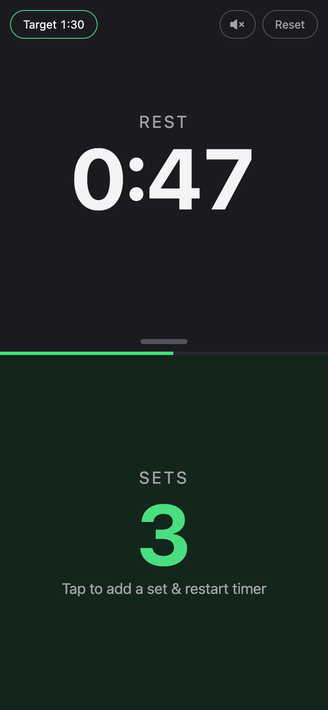
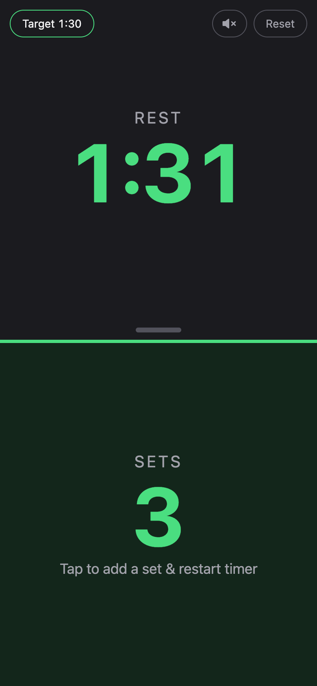
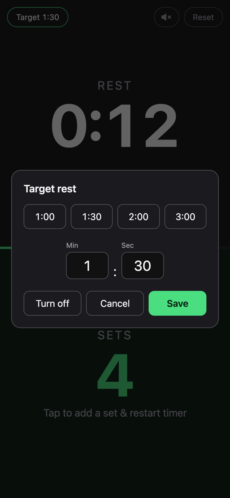
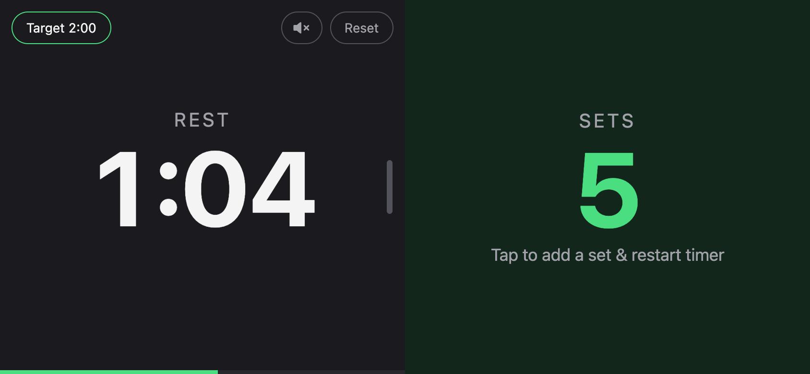

# Counter Timer

A rest timer and set counter for the gym, built as a mobile-first progressive web app. Tap to log a set, and the rest timer starts again from zero. Set a target rest time and your phone notifies you when it's up, even if the screen is locked or you've switched apps.

<p align="center">
  
  &nbsp;
  
  &nbsp;
  
</p>

<p align="center">
  
</p>

## Features

- **One tap per set.** Tapping the bottom panel adds a set and restarts the rest timer at 0:00.
- **Target rest time.** Pick a preset (1:00, 1:30, 2:00, 3:00) or enter your own. A progress bar fills toward the target, and the timer turns green when you reach it.
- **Push notifications.** A "Rest over / 1:30 up" notification arrives at the target time, even when the phone is locked or another app is open.
- **Accurate after backgrounding.** Elapsed time is calculated from the device clock, not from a ticking JavaScript timer, so switching apps or locking the screen loses no time.
- **In-app alert.** When the target is reached the timer turns green and pulses, and the phone vibrates (Android). An optional beep is muted by default and toggled with the speaker button.
- **Adjustable split.** Drag the divider to resize the panels. They stack in portrait and sit side by side in landscape.
- **Works offline.** The app loads and times rests with no connection. Only push notifications need a signal, and a badge warns you when one couldn't be scheduled.
- **Keeps the screen awake** while a rest is running, where the browser supports the Wake Lock API.

## How it works

```
Phone (PWA)                        Cloudflare Worker                 Push service
───────────                        ─────────────────                 ────────────
tap counter ── POST /api/schedule ─► Durable Object (one per device)
                { fireAt, … }        stores subscription,
                                     sets an alarm for fireAt
                                          │  alarm fires
                                          └── Web Push (VAPID) ───► FCM / APNs / …
service worker ◄───────────────────────────────────────────────────── notification
```

Browsers can't schedule a notification for later from the page itself, and iOS stops PWA JavaScript in the background. So the page sends the target time to a small server, which sends a Web Push at that moment. Each device gets its own Durable Object, and its alarm fires at the exact target time. Tapping again replaces the alarm, and Reset or turning the target off cancels it.

- **Frontend** (`public/`): plain HTML, CSS and JavaScript, with no build step. [gridstack.js](https://gridstackjs.com/) handles the resizable panels and is vendored in `public/vendor/` so the app works offline.
- **Backend** (`src/worker.js`): one Cloudflare Worker that serves the static app and a small `/api`, plus the `RestAlarm` Durable Object. Push payloads are encrypted with [`@pushforge/builder`](https://www.npmjs.com/package/@pushforge/builder), which uses the Web Crypto API.

## Project structure

```
public/                   the PWA (served as static assets)
  index.html, styles.css, app.js
  sw.js                   offline cache + push/notification handlers
  manifest.webmanifest
  icons/                  app icons and the Android notification badge
  vendor/gridstack/
src/worker.js             API routes + RestAlarm Durable Object
scripts/generate-vapid-keys.js
wrangler.jsonc            Worker config (assets, Durable Object, logs)
```

## Running locally

Requires Node.js 20 or later.

```sh
npm install
npm run vapid          # creates .dev.vars with a VAPID key pair
```

Open `.dev.vars` and set `VAPID_SUBJECT` to a `mailto:` address or URL where push services can reach you. Then:

```sh
npm run dev            # http://localhost:8787
```

Push works on `localhost` in Chrome. To test on a phone, use a deployed HTTPS URL.

## Deploying

The app runs on Cloudflare Workers. The Free plan is enough for personal use.

1. Create the Worker. Either:
   - **From GitHub:** in the Cloudflare dashboard, go to **Workers & Pages → Create → Import a repository**, pick this repo, and keep the default deploy command (`npx wrangler deploy`). Every push to `main` then deploys automatically.
   - **From your machine:** run `npx wrangler login`, then `npm run deploy`.
2. Add three **secrets** with the values from `.dev.vars`. In the dashboard, go to **Settings → Variables and Secrets** and choose type *Secret*. From the CLI, run `npx wrangler secret put <NAME>`.
   - `VAPID_PUBLIC_KEY`
   - `VAPID_PRIVATE_JWK`: the JSON object, without the surrounding quotes
   - `VAPID_SUBJECT`
3. Check that `https://<your-worker-url>/api/vapid-public-key` returns your public key.

Keep a backup of `.dev.vars`. It's gitignored, and if you replace the keys, every device has to enable alerts again.

### Updating

Changes in `public/` are cached by the service worker. When you change anything there, bump `CACHE` in `public/sw.js` so installed apps pick up the new version.

## Installing on your phone

- **iPhone (iOS 16.4 or later):** open the site in Safari, tap **Share → Add to Home Screen**, and open the app from the Home Screen. iOS only allows push notifications for web apps opened this way.
- **Android:** open the site in Chrome and tap **Install app**, or use menu → **Add to Home screen**.

Then set a target and tap **Enable alerts**.

## Notes

- **Notifications need a signal** at two moments: when you tap (to schedule the push) and at the target time (to receive it). Pushes expire after 60 seconds, so a late "Rest over" never arrives long after your rest ended.
- **iPhone:** the in-app beep is silenced by the silent switch, and web apps can't vibrate. Push notifications are the reliable alert on iOS.
- **Data:** your count, target, sound setting and panel split are stored on the device in `localStorage`. The server stores only each device's push subscription and its next alarm.
